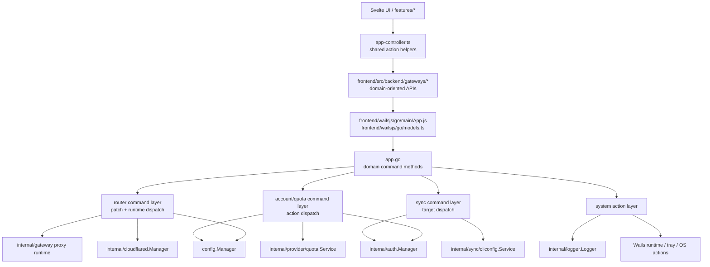

# Design Document - App Boundary Simplification

## Overview

Refactor ini memperluas pola yang sudah dipakai di auth API simplification ke seluruh boundary `app.go` <-> Wails bindings <-> frontend gateway layer.

Fokusnya bukan mengubah business logic inti, tapi mengecilkan dan menstabilkan API surface dengan tiga prinsip utama:

1. gunakan typed DTO di boundary backend-frontend
2. gabungkan setter/action yang serupa menjadi command atau patch API per domain
3. rapikan frontend agar feature code bergantung pada gateway domain yang kecil dan konsisten

Scope desain ini dibatasi pada domain yang saat ini paling banyak duplikasi:

- proxy/router/cloudflared
- account/quota actions
- CLI sync dan account auth sync
- system/window actions
- frontend controller + gateway wiring

Internal service yang sudah ada tetap dipakai. Adapter, dispatcher, dan DTO baru ditempatkan di layer boundary agar perubahan aman dan bertahap.

---

## Architecture



### Design direction

- `app.go` tetap jadi Wails bridge tunggal, tapi method exported dikurangi menjadi command-style API per domain.
- Adapter/facade dipakai untuk membungkus logic existing yang sekarang tersebar di banyak method kecil.
- DTO typed jadi kontrak utama antar backend dan frontend.
- Generated Wails bindings tetap dipakai, tapi frontend tidak lagi memperlakukan raw binding sebagai API desain utama.

---

## Domain Model and Command Shapes

### 1. Router domain

Router domain saat ini terdiri dari dua jenis operasi:

- read state: proxy status, cloudflared status, local model catalog, model aliases, CLI sync status
- mutate state/runtime: set proxy options, set cloudflared config, start/stop proxy, install/start/stop cloudflared, sync CLI config

Desain baru memisahkan tiga kategori ini secara eksplisit.

#### Read DTOs

```go
type ModelCatalogItem struct {
    ID      string `json:"id"`
    OwnedBy string `json:"ownedBy"`
}

type CLISyncFileDTO struct {
    Name string `json:"name"`
    Path string `json:"path"`
}

type CLISyncStatusDTO struct {
    ID             string           `json:"id"`
    Label          string           `json:"label"`
    Installed      bool             `json:"installed"`
    InstallPath    string           `json:"installPath,omitempty"`
    Version        string           `json:"version,omitempty"`
    Synced         bool             `json:"synced"`
    CurrentBaseURL string           `json:"currentBaseUrl,omitempty"`
    CurrentModel   string           `json:"currentModel,omitempty"`
    Files          []CLISyncFileDTO `json:"files"`
}

type CLISyncResultDTO struct {
    ID             string           `json:"id"`
    Label          string           `json:"label"`
    Model          string           `json:"model,omitempty"`
    CurrentBaseURL string           `json:"currentBaseUrl,omitempty"`
    Files          []CLISyncFileDTO `json:"files"`
}
```

`GetProxyStatus()` sudah relatif typed secara payload, jadi fokus utama di router domain adalah mengganti `map[string]any` dan `[]map[string]any` lain yang masih manual.

#### Patch DTOs

```go
type UpdateProxySettingsInput struct {
    Port              *int    `json:"port,omitempty"`
    AllowLAN          *bool   `json:"allowLan,omitempty"`
    AutoStartProxy    *bool   `json:"autoStartProxy,omitempty"`
    ProxyAPIKey       *string `json:"proxyApiKey,omitempty"`
    RegenerateAPIKey  bool    `json:"regenerateApiKey,omitempty"`
    AuthorizationMode *bool   `json:"authorizationMode,omitempty"`
    SchedulingMode    *string `json:"schedulingMode,omitempty"`
}

type UpdateCloudflaredSettingsInput struct {
    Mode     *string `json:"mode,omitempty"`
    Token    *string `json:"token,omitempty"`
    UseHTTP2 *bool   `json:"useHttp2,omitempty"`
}
```

Pointer dipakai agar "field tidak dikirim" bisa dibedakan dari nilai zero-value yang memang ingin di-set.

#### Runtime command DTOs

```go
type ProxyRuntimeAction string

const (
    ProxyActionStart  ProxyRuntimeAction = "start"
    ProxyActionStop   ProxyRuntimeAction = "stop"
    ProxyActionToggle ProxyRuntimeAction = "toggle"
)

type CloudflaredAction string

const (
    CloudflaredActionInstall       CloudflaredAction = "install"
    CloudflaredActionStart         CloudflaredAction = "start"
    CloudflaredActionStop          CloudflaredAction = "stop"
    CloudflaredActionRefreshStatus CloudflaredAction = "refresh-status"
)
```

---

### 2. Accounts and quota domain

Account domain sekarang punya kombinasi mutation entity-level dan quota-wide operations. Karena semantiknya beda, desain memisahkan keduanya.

#### Account action DTO

```go
type AccountAction string

const (
    AccountActionRefresh          AccountAction = "refresh"
    AccountActionRefreshWithQuota AccountAction = "refresh-with-quota"
    AccountActionEnable           AccountAction = "enable"
    AccountActionDisable          AccountAction = "disable"
    AccountActionDelete           AccountAction = "delete"
    AccountActionClearCooldown    AccountAction = "clear-cooldown"
)

type RunAccountActionInput struct {
    AccountID string        `json:"accountId"`
    Action    AccountAction `json:"action"`
}
```

#### Quota action DTO

```go
type QuotaAction string

const (
    QuotaActionRefreshOne      QuotaAction = "refresh-one"
    QuotaActionRefreshAll      QuotaAction = "refresh-all"
    QuotaActionForceRefreshAll QuotaAction = "force-refresh-all"
)

type RunQuotaActionInput struct {
    Action    QuotaAction `json:"action"`
    AccountID string      `json:"accountId,omitempty"`
}
```

`toggleAccount(enabled)` tidak dipertahankan sebagai boolean command generik. Di boundary baru, enable dan disable dibuat eksplisit sebagai action berbeda supaya call site lebih jelas dan mengurangi branching di backend.

---

### 3. Sync domain

Sync domain terdiri dari dua family yang berbeda tapi mirip pola dispatch-nya:

- CLI config sync (`cliconfig`)
- account auth sync (`authtoken` via `auth.Manager`)

Desain menyamakan pola target-based dispatch tapi tidak memaksa dua family ini menjadi satu method yang terlalu generik.

#### CLI sync request DTOs

```go
type CLISyncTarget string

type RunCLISyncInput struct {
    Target string `json:"target"`
    Model  string `json:"model,omitempty"`
}

type CLISyncFileInput struct {
    Target string `json:"target"`
    Path   string `json:"path"`
}

type SaveCLISyncFileInput struct {
    Target  string `json:"target"`
    Path    string `json:"path"`
    Content string `json:"content"`
}
```

#### Account auth sync DTO

Auth sync API yang sudah dibuat di refactor sebelumnya dipertahankan sebagai baseline, tapi frontend layer akan disederhanakan agar seluruh target memanggil satu helper generic.

```go
type RunAccountAuthSyncInput struct {
    AccountID string         `json:"accountId"`
    Target    AuthSyncTarget `json:"target"`
}
```

---

### 4. System domain

System domain saat ini punya action kecil seperti `ConfirmQuit`, `HideToTray`, `RestoreWindow`, `OpenDataDir`, `OpenExternalURL`, dan `ClearLogs`.

Tidak semua action perlu digenerikkan secara agresif. Desain ini membagi dua:

- effectful actions tanpa payload kompleks -> command action string
- actions dengan payload unik -> tetap typed method

#### System action DTO

```go
type SystemAction string

const (
    SystemActionConfirmQuit  SystemAction = "confirm-quit"
    SystemActionHideToTray   SystemAction = "hide-to-tray"
    SystemActionRestoreWindow SystemAction = "restore-window"
    SystemActionOpenDataDir  SystemAction = "open-data-dir"
    SystemActionClearLogs    SystemAction = "clear-logs"
)

type RunSystemActionInput struct {
    Action SystemAction `json:"action"`
}
```

`OpenExternalURL(url)` dipertahankan sebagai typed method terpisah karena payload-nya unik dan tidak mendapat benefit besar dari action string generalization.

---

## Components and Interfaces

### 1. `app.go` exported API shape

Wails bridge baru akan bergerak ke API surface seperti ini:

```go
// reads
func (a *App) GetState() State
func (a *App) GetAccounts() []config.Account
func (a *App) GetProxyStatus() ProxyStatusDTO
func (a *App) GetLocalModelCatalog() []ModelCatalogItem
func (a *App) GetCLISyncStatuses() ([]CLISyncStatusDTO, error)
func (a *App) GetCLISyncFile(input CLISyncFileInput) (string, error)

// router/config mutations
func (a *App) UpdateProxySettings(input UpdateProxySettingsInput) (*ProxySettingsUpdateResult, error)
func (a *App) UpdateCloudflaredSettings(input UpdateCloudflaredSettingsInput) error
func (a *App) RunProxyAction(action string) error
func (a *App) RunCloudflaredAction(action string) (*ProxyStatusDTO, error)
func (a *App) RunCLISync(input RunCLISyncInput) (CLISyncResultDTO, error)
func (a *App) SaveCLISyncFile(input SaveCLISyncFileInput) error

// accounts/quota
func (a *App) RunAccountAction(input RunAccountActionInput) error
func (a *App) RunQuotaAction(input RunQuotaActionInput) error
func (a *App) ImportAccounts(accounts []config.Account) (int, error)

// auth sync (existing generic pattern)
func (a *App) SyncAccountAuth(accountID string, target string) (auth.AuthSyncResult, error)

// system
func (a *App) RunSystemAction(input RunSystemActionInput) error
func (a *App) OpenExternalURL(rawURL string)
func (a *App) GetLogs(limit int) []logger.Entry
```

Catatan penting:

- `GetState()` dan `GetAccounts()` tidak perlu diubah jika sudah cukup stabil dan typed.
- `SyncAccountAuth()` boleh tetap memakai signature sebelumnya untuk menjaga kompatibilitas incremental, lalu frontend yang digenerikkan lebih dulu.
- `RunCloudflaredAction("refresh-status")` bisa menggantikan `RefreshCloudflaredStatus()` agar seluruh runtime actions seragam.

### 2. Router facade/helper di backend

Untuk menjaga `app.go` tetap tipis, desain menyarankan helper internal seperti:

```go
type RouterCommands struct {
    store *config.Manager
    proxy proxyController
    cf    cloudflaredController
    log   *logger.Logger
}

func (r *RouterCommands) UpdateProxySettings(input UpdateProxySettingsInput) (*ProxySettingsUpdateResult, error)
func (r *RouterCommands) UpdateCloudflaredSettings(input UpdateCloudflaredSettingsInput) error
func (r *RouterCommands) RunProxyAction(action ProxyRuntimeAction) error
func (r *RouterCommands) RunCloudflaredAction(action CloudflaredAction) (*ProxyStatusDTO, error)
```

Ini bisa ditempatkan sebagai helper private di package `main` atau package internal baru kecil jika nanti logic-nya membesar. Tujuannya mengeluarkan sequencing logic dari `app.go`, bukan memindahkan business logic inti ke tempat lain.

### 3. Account/quota dispatcher di backend

Pattern yang sama dipakai untuk account/quota actions:

```go
func (a *App) RunAccountAction(input RunAccountActionInput) error {
    switch input.Action {
    case AccountActionRefresh:
        _, err := a.auth.RefreshAccount(input.AccountID)
        return err
    case AccountActionRefreshWithQuota:
        _, err := a.quota.RefreshAccountWithQuota(input.AccountID)
        return err
    case AccountActionEnable:
        return a.store.UpdateAccount(...)
    case AccountActionDisable:
        return a.store.UpdateAccount(...)
    case AccountActionDelete:
        return a.store.DeleteAccount(input.AccountID)
    case AccountActionClearCooldown:
        return a.ClearCooldown(input.AccountID)
    default:
        return fmt.Errorf("unsupported account action: %s", input.Action)
    }
}
```

`RunQuotaAction` men-dispatch ke quota service yang sudah ada.

### 4. Frontend gateway interfaces

Frontend gateway setelah migrasi akan bergerak ke bentuk seperti ini:

```ts
export const routerApi = {
  getProxyStatus(): Promise<ProxyStatus>
  getLocalModelCatalog(): Promise<LocalModelCatalogItem[]>
  getCliSyncStatuses(): Promise<CliSyncStatus[]>
  updateProxySettings(input: UpdateProxySettingsInput): Promise<ProxySettingsUpdateResult>
  updateCloudflaredSettings(input: UpdateCloudflaredSettingsInput): Promise<void>
  runProxyAction(action: ProxyRuntimeAction): Promise<void>
  runCloudflaredAction(action: CloudflaredAction): Promise<ProxyStatus>
  runCliSync(input: RunCliSyncInput): Promise<CliSyncResult>
  getCliSyncFile(input: CliSyncFileInput): Promise<string>
  saveCliSyncFile(input: SaveCliSyncFileInput): Promise<void>
}

export const accountsApi = {
  getAccounts(): Promise<Account[]>
  importAccounts(accounts: Account[]): Promise<number>
  runAccountAction(input: RunAccountActionInput): Promise<void>
  runQuotaAction(input: RunQuotaActionInput): Promise<void>
  syncAccountAuth(accountId: string, target: SyncTargetID): Promise<AccountSyncResult>
}

export const systemApi = {
  getState(): Promise<AppState>
  getHostName(): Promise<string>
  runSystemAction(action: SystemAction): Promise<void>
  openExternalURL(url: string): Promise<void>
}
```

---

## Data Models

### Frontend type changes

Frontend perlu menambahkan input types yang mencerminkan command contracts baru.

```ts
export interface UpdateProxySettingsInput {
  port?: number
  allowLan?: boolean
  autoStartProxy?: boolean
  proxyApiKey?: string
  regenerateApiKey?: boolean
  authorizationMode?: boolean
  schedulingMode?: string
}

export interface UpdateCloudflaredSettingsInput {
  mode?: 'quick' | 'auth'
  token?: string
  useHttp2?: boolean
}

export type ProxyRuntimeAction = 'start' | 'stop' | 'toggle'
export type CloudflaredAction = 'install' | 'start' | 'stop' | 'refresh-status'

export type AccountAction =
  | 'refresh'
  | 'refresh-with-quota'
  | 'enable'
  | 'disable'
  | 'delete'
  | 'clear-cooldown'

export type QuotaAction = 'refresh-one' | 'refresh-all' | 'force-refresh-all'

export type SystemAction =
  | 'confirm-quit'
  | 'hide-to-tray'
  | 'restore-window'
  | 'open-data-dir'
  | 'clear-logs'
```

### Result models

Untuk hasil update proxy settings, ada dua opsi:

1. return `void` lalu frontend refresh state terpisah
2. return result typed yang menjelaskan apa yang berubah

Desain ini merekomendasikan opsi kedua untuk mengurangi fetch tambahan pada aksi konfigurasi yang sering dilakukan.

```go
type ProxySettingsUpdateResult struct {
    RestartedProxy       bool   `json:"restartedProxy"`
    RestartedCloudflared bool   `json:"restartedCloudflared"`
    GeneratedAPIKey      string `json:"generatedApiKey,omitempty"`
}
```

Field ini berguna terutama untuk kasus `regenerateApiKey` dan perubahan yang memicu restart runtime.

---

## Behavior and Sequencing Rules

### Proxy settings sequencing

`SetProxyPort` dan `SetAllowLAN` saat ini punya sequencing sensitif:

1. stop cloudflared runtime jika perlu
2. stop proxy jika sedang running
3. update persisted config
4. start kembali proxy jika sebelumnya running
5. start kembali cloudflared jika sebelumnya enabled

Desain baru mempertahankan sequencing itu di satu helper bersama:

```go
func (r *RouterCommands) applyProxyRuntimeSensitivePatch(input UpdateProxySettingsInput) (*ProxySettingsUpdateResult, error)
```

Rule:

- perubahan `port` atau `allowLan` masuk jalur runtime-sensitive
- perubahan `autoStartProxy`, `authorizationMode`, `schedulingMode`, `proxyApiKey` tidak butuh restart runtime
- `regenerateApiKey` hanya generate dan persist key baru tanpa restart runtime

### Cloudflared settings sequencing

Update config cloudflared tetap hanya mengubah persisted config. Runtime start/stop/install tetap dilakukan melalui `RunCloudflaredAction`.

### Account/quota command sequencing

- `refresh-with-quota` tetap memicu alur refresh auth lalu quota seperti perilaku sekarang
- `refresh-all` dan `force-refresh-all` tetap memakai quota service existing
- `enable` dan `disable` mempertahankan seluruh health-state handling yang saat ini ada di `ToggleAccount`

---

## Frontend Controller Refactor Strategy

`frontend/src/app/services/app-controller.ts` saat ini punya banyak handler yang bentuknya identik: panggil gateway, refresh state tertentu, tampilkan toast sukses/gagal.

Desain baru menambahkan helper reusable berbasis descriptor.

### Generic action runner

```ts
interface CommandDescriptor<T = void> {
  run: () => Promise<T>
  refresh?: () => Promise<void>
  successToast?: { title: string; message: string }
  errorTitle: string
}
```

Lalu berbagai handler dibangun dari helper ini.

Contoh:

```ts
const runAccountCommand = (input: RunAccountActionInput, options: ...) =>
  runAppAction({
    run: () => accountsApi.runAccountAction(input),
    refresh: refreshAccountsSnapshot,
    successToast: options.successToast,
    errorTitle: options.errorTitle
  })
```

Hasil yang diinginkan:

- tidak ada lagi handler terpisah per target sync hanya untuk mengubah string target
- tidak ada lagi enam handler router setter yang semuanya mirip
- action publik yang diekspos ke komponen tetap jelas, tetapi implementasinya ditopang helper generic

---

## Migration Plan

Refactor dilakukan bertahap agar risiko rendah.

### Phase 1 - Typed DTO migration

- ganti return `map[string]any` dan `[]map[string]any` ke DTO typed
- regenerate Wails bindings
- update frontend compat types yang membaca hasil tersebut

### Phase 2 - Router/proxy/cloudflared command migration

- perkenalkan `UpdateProxySettings`
- perkenalkan `UpdateCloudflaredSettings`
- perkenalkan `RunProxyAction` dan `RunCloudflaredAction`
- hapus method lama setelah semua call site pindah

### Phase 3 - Account/quota command migration

- perkenalkan `RunAccountAction`
- perkenalkan `RunQuotaAction`
- migrasikan controller/frontend
- hapus method lama

### Phase 4 - Frontend controller consolidation

- konsolidasikan helper handler di `app-controller.ts`
- rapikan `accounts-gateway.ts`, `router-gateway.ts`, `system-gateway.ts`
- hilangkan wrapper frontend yang cuma hardcoded target/action

### Phase 5 - Cleanup and validation

- cari seluruh referensi method lama
- hapus dead code dan compat yang tidak diperlukan
- jalankan `go test . ./internal/...`
- jalankan `cd frontend && npm run check`
- jalankan `wails build`

---

## Error Handling

- Semua action dispatcher wajib validate `action`/`target` dan field wajib sebelum menyentuh service.
- Semua patch API wajib fail-fast jika ada field invalid.
- Semua error backend dibungkus context yang jelas, mis. `unsupported quota action`, `proxy settings validation failed`, `unsupported cli sync target`.
- Logging existing dipertahankan di titik side effect penting: proxy runtime, cloudflared runtime, sync operations, destructive account actions.

---

## Testing Strategy

### Backend

- unit test untuk DTO/dispatcher baru jika ditempatkan di package testable
- test sequencing untuk proxy runtime-sensitive patch
- test action validation untuk proxy/cloudflared/account/quota/system commands
- regression test untuk CLI sync typed mapping

### Frontend

- `npm run check` untuk validasi type contract baru
- update minimal tests atau mock expectations jika ada
- verifikasi semua feature call site memakai gateway baru, bukan binding flat lama

### End-to-end validation

- proxy start/stop tetap berjalan
- port/LAN update tetap merefresh runtime dengan benar
- cloudflared install/start/stop/status refresh tetap benar
- CLI sync status/read/write/sync tetap benar
- account enable/disable/delete/clear cooldown tetap benar
- refresh quota one/all/force all tetap benar
- desktop actions seperti hide to tray / restore / confirm quit tetap benar

---

## Open Decisions

Ada beberapa keputusan desain yang masih bisa dipilih saat implementasi:

1. `RunSystemAction` apakah mencakup `clear-logs` atau logs tetap dipisah di `logs-gateway`
2. `SyncAccountAuth` dipertahankan signature lama atau ikut dipindah ke input object typed demi konsistensi penuh
3. helper backend dispatcher ditempatkan di `app.go`, file helper dekat `main`, atau package internal baru kecil
4. `UpdateProxySettings` return `void` atau `ProxySettingsUpdateResult`

Rekomendasi desain ini:

- masukkan `clear-logs` ke `RunSystemAction` kalau ingin surface minimal; kalau ingin domain separation yang lebih ketat, biarkan logs tetap domain sendiri
- pertahankan `SyncAccountAuth(accountID, target)` dulu untuk migrasi incremental
- tempatkan dispatcher helper di file terpisah dekat `app.go` sebelum membuat package internal baru
- return `ProxySettingsUpdateResult` agar frontend tidak perlu fetch tambahan untuk info restart/generated key
