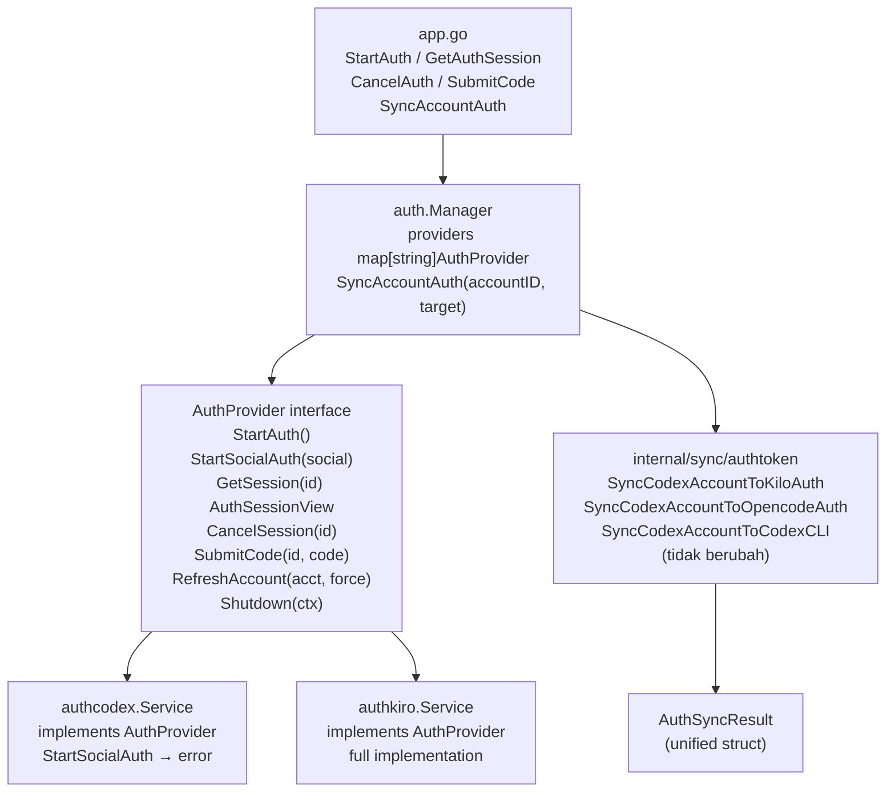

# Design Document — Auth API Simplification

## Overview

Refactor `internal/auth` dan `app.go` menjadi API surface yang lebih kecil dengan mengenalkan:

1. Interface `AuthProvider` yang di-share oleh kedua sub-service
2. Provider dispatch via `map[string]AuthProvider` di `auth.Manager`
3. Unified sync entry point dengan `AuthSyncTarget` enum
4. Unified `AuthSessionView` dan `AuthStart` di root `auth` package

Tidak ada perubahan pada logika internal `authcodex.Service` atau `authkiro.Service`. Perubahan murni di lapisan `auth.Manager` ke atas.

---

## Architecture



---

## Components dan Interfaces

### 1. `AuthProvider` interface — `internal/auth/provider.go` (file baru)

```go
type AuthProvider interface {
    StartAuth() (*AuthStart, error)
    StartSocialAuth(socialProvider string) (*AuthStart, error)
    GetSession(sessionID string) AuthSessionView
    CancelSession(sessionID string)
    SubmitCode(sessionID, code string) error
    RefreshAccount(account config.Account, force bool) (config.Account, error)
    Shutdown(ctx context.Context) error
}
```

`AuthStart` dan `AuthSessionView` di root package adalah unified type — bukan alias ke sub-package lagi.

---

### 2. Unified types — `internal/auth/types.go` (update)

Saat ini `types.go` menggunakan type alias ke sub-package:
```go
// SEKARANG — alias ke sub-package
type CodexAuthStart    = authcodex.AuthStart
type KiroAuthStart     = authkiro.AuthStart
type CodexAuthSessionView = authcodex.AuthSessionView
type KiroAuthSessionView  = authkiro.AuthSessionView
```

Setelah refactor — satu set canonical type di root package:
```go
// SESUDAH — canonical di root auth package
type AuthStart struct {
    SessionID   string `json:"sessionId"`
    AuthURL     string `json:"authUrl"`
    CallbackURL string `json:"callbackUrl,omitempty"`
    Status      string `json:"status"`
}

type AuthSessionView struct {
    SessionID string `json:"sessionId"`
    AuthURL   string `json:"authUrl,omitempty"`
    Status    string `json:"status"`
    Error     string `json:"error,omitempty"`
    Provider  string `json:"provider,omitempty"` // field baru untuk context
}

// Re-export sync result types tetap dari syncauth
type KiloAuthSyncResult    = syncauth.KiloAuthSyncResult     // phase 1: tetap
type OpencodeAuthSyncResult = syncauth.OpencodeAuthSyncResult // phase 1: tetap
type CodexAuthSyncResult   = syncauth.CodexAuthSyncResult     // phase 1: tetap

// Unified sync result — untuk SyncAccountAuth
type AuthSyncResult struct {
    Target     string `json:"target"`
    Path       string `json:"path"`
    BackedUp   bool   `json:"backedUp"`
    BackupPath string `json:"backupPath,omitempty"`
    Created    bool   `json:"created"`
}

// Sync target enum
type AuthSyncTarget string

const (
    SyncTargetKilo     AuthSyncTarget = "kilo"
    SyncTargetOpencode AuthSyncTarget = "opencode"
    SyncTargetCodexCLI AuthSyncTarget = "codex-cli"
)
```

---

### 3. `auth.Manager` — `internal/auth/manager.go` (update)

**Struct sebelum:**
```go
type Manager struct {
    store *config.Manager
    mu    sync.RWMutex
    client *http.Client
    quotaRefresher quotaRefresher
    codex *authcodex.Service   // field spesifik provider
    kiro  *authkiro.Service    // field spesifik provider
}
```

**Struct sesudah:**
```go
type Manager struct {
    store     *config.Manager
    mu        sync.RWMutex
    client    *http.Client
    quotaRefresher quotaRefresher
    providers map[string]AuthProvider  // dispatch generik
}
```

**Method baru di Manager (menggantikan 9 method lama):**
```go
func (m *Manager) providerFor(name string) (AuthProvider, error)

func (m *Manager) StartAuth(provider string) (*AuthStart, error)
func (m *Manager) StartSocialAuth(provider, socialProvider string) (*AuthStart, error)
func (m *Manager) GetSession(provider, sessionID string) AuthSessionView
func (m *Manager) CancelSession(provider, sessionID string)
func (m *Manager) SubmitCode(provider, sessionID, code string) error

func (m *Manager) SyncAccountAuth(accountID string, target AuthSyncTarget) (AuthSyncResult, error)
```

**Method dihapus dari Manager:**
```
StartCodexAuth / GetCodexAuthSession / CancelCodexAuth / SubmitCodexAuthCode
StartKiroAuth / StartKiroSocialAuth / GetKiroAuthSession / CancelKiroAuth / SubmitKiroAuthCode
SyncCodexAccountToKiloAuth / SyncCodexAccountToOpencodeAuth / SyncCodexAccountToCodexCLI
GetAllKiroAuthSessions  ← dipertahankan internal, dipanggil via providerFor("kiro")
```

**`providerFor` helper:**
```go
func (m *Manager) providerFor(name string) (AuthProvider, error) {
    p, ok := m.providers[strings.ToLower(strings.TrimSpace(name))]
    if !ok {
        return nil, fmt.Errorf("unknown provider: %s", name)
    }
    return p, nil
}
```

---

### 4. Adapter layer — `authcodex.Service` dan `authkiro.Service`

Kedua service tidak perlu diubah secara internal. Yang perlu ditambahkan hanya method adapter agar mereka memenuhi `AuthProvider`:

**`authcodex.Service` perlu tambahan:**
```go
// GetSession wraps GetAuthSession agar cocok dengan interface
func (s *Service) GetSession(sessionID string) auth.AuthSessionView { ... }
func (s *Service) CancelSession(sessionID string) { s.CancelAuth(sessionID) }
func (s *Service) SubmitCode(sessionID, code string) error { return s.SubmitAuthCode(sessionID, code) }

// StartSocialAuth — not supported
func (s *Service) StartSocialAuth(_ string) (*auth.AuthStart, error) {
    return nil, fmt.Errorf("social auth not supported for provider codex")
}
```

> **Alternatif lebih bersih**: rename method di service langsung (`GetAuthSession` → `GetSession`) agar tidak ada wrapper. Tapi ini menyentuh internal — pilih sesuai toleransi perubahan.

**`authkiro.Service` perlu tambahan:**
```go
func (s *Service) GetSession(sessionID string) auth.AuthSessionView { ... }
func (s *Service) CancelSession(sessionID string) { s.CancelAuth(sessionID) }
func (s *Service) SubmitCode(sessionID, code string) error { return s.SubmitAuthCode(sessionID, code) }
// StartSocialAuth sudah ada — hanya perlu return type disesuaikan
```

---

### 5. `SyncAccountAuth` dispatch — `internal/auth/manager.go`

```go
func (m *Manager) SyncAccountAuth(accountID string, target AuthSyncTarget) (AuthSyncResult, error) {
    account, err := m.findCodexAccountForSync(accountID, string(target))
    if err != nil {
        return AuthSyncResult{}, err
    }
    switch target {
    case SyncTargetKilo:
        r, err := syncauth.SyncCodexAccountToKiloAuth(account)
        return AuthSyncResult{Target: string(target), Path: r.Path, BackedUp: r.BackedUp, BackupPath: r.BackupPath, Created: r.Created}, err
    case SyncTargetOpencode:
        r, err := syncauth.SyncCodexAccountToOpencodeAuth(account)
        return AuthSyncResult{Target: string(target), Path: r.Path, BackedUp: r.BackedUp, BackupPath: r.BackupPath, Created: r.Created}, err
    case SyncTargetCodexCLI:
        r, err := syncauth.SyncCodexAccountToCodexCLI(account)
        return AuthSyncResult{Target: string(target), Path: r.Path, BackedUp: r.BackedUp, BackupPath: r.BackupPath}, err
    default:
        return AuthSyncResult{}, fmt.Errorf("unknown sync target: %s", target)
    }
}
```

---

### 6. `app.go` — Wails surface baru

**Method auth baru (menggantikan 9 method lama):**
```go
func (a *App) StartAuth(provider string) (*auth.AuthStart, error)
func (a *App) StartSocialAuth(provider, socialProvider string) (*auth.AuthStart, error)
func (a *App) GetAuthSession(provider, sessionID string) auth.AuthSessionView
func (a *App) CancelAuth(provider, sessionID string)
func (a *App) SubmitAuthCode(provider, sessionID, code string) error
```

**Method sync baru (menggantikan 3 method lama):**
```go
func (a *App) SyncAccountAuth(accountID, target string) (auth.AuthSyncResult, error)
```

**Kasus khusus — `handleKiroProtocolURL`:**

`app.go:1196` memanggil `a.auth.GetAllKiroAuthSessions()` untuk handle deep-link. Ini tetap dipertahankan sebagai method internal di Manager:
```go
func (m *Manager) kiroSessions() []AuthSessionView {
    p, _ := m.providerFor("kiro")
    // type-assert ke authkiro.Service untuk akses GetAllAuthSessions
}
```

---

### 7. Frontend Gateway — `auth-gateway.ts`

```typescript
// SEBELUM
startCodexAuth: () => client.StartCodexAuth(),
getCodexAuthSession: (id) => client.GetCodexAuthSession(id),
cancelCodexAuth: (id) => client.CancelCodexAuth(id),
submitCodexAuthCode: (id, code) => client.SubmitCodexAuthCode(id, code),
startKiroAuth: () => client.StartKiroAuth(),
startKiroSocialAuth: (p) => client.StartKiroSocialAuth(p),
getKiroAuthSession: (id) => client.GetKiroAuthSession(id),
cancelKiroAuth: (id) => client.CancelKiroAuth(id),
submitKiroAuthCode: (id, code) => client.SubmitKiroAuthCode(id, code),
syncCodexAccountToKiloAuth: (id) => client.SyncCodexAccountToKiloAuth(id),
syncCodexAccountToOpencodeAuth: (id) => client.SyncCodexAccountToOpencodeAuth(id),
syncCodexAccountToCodexCLI: (id) => client.SyncCodexAccountToCodexCLI(id),

// SESUDAH
startAuth: (provider) => client.StartAuth(provider),
startSocialAuth: (provider, social) => client.StartSocialAuth(provider, social),
getAuthSession: (provider, id) => client.GetAuthSession(provider, id),
cancelAuth: (provider, id) => client.CancelAuth(provider, id),
submitAuthCode: (provider, id, code) => client.SubmitAuthCode(provider, id, code),
syncAccountAuth: (accountId, target) => client.SyncAccountAuth(accountId, target),
```

---

## Data Models

### `AuthSyncResult` field mapping dari existing types

| Field `AuthSyncResult` | `KiloAuthSyncResult` | `OpencodeAuthSyncResult` | `CodexAuthSyncResult` |
|---|---|---|---|
| `Target` | — (baru) | — (baru) | — (baru) |
| `Path` | `Path` | `Path` | `Path` |
| `BackedUp` | `BackedUp` | `BackedUp` | `BackedUp` |
| `BackupPath` | `BackupPath` | `BackupPath` | `BackupPath` |
| `Created` | `Created` | `Created` | — (false default) |

Tidak ada data loss. Semua field yang relevan terpetakan.

---

## Error Handling

- `providerFor(name)` → `fmt.Errorf("unknown provider: %s", name)` jika tidak ada di map
- `StartSocialAuth("codex", ...)` → `fmt.Errorf("social auth not supported for provider codex")`
- `SyncAccountAuth(id, unknownTarget)` → `fmt.Errorf("unknown sync target: %s", target)`
- Semua error dari sub-service di-wrap dengan `fmt.Errorf("provider %s: %w", name, err)` untuk konteks

---

## Testing Strategy

- Tambah compile-time assertion di `internal/auth/provider.go`:
  ```go
  var _ AuthProvider = (*authcodex.Service)(nil)
  var _ AuthProvider = (*authkiro.Service)(nil)
  ```
- Update existing tests di `internal/auth/` yang mock `StartCodexAuth` / `StartKiroAuth` → ganti ke `StartAuth("codex")` / `StartAuth("kiro")`
- `go test ./internal/...` harus tetap hijau setelah setiap task

---

## Keputusan Desain

| Keputusan | Alasan |
|---|---|
| Unified `AuthStart` / `AuthSessionView` di root package, bukan di sub-package | Menghindari import cycle dan memudahkan frontend — satu return type untuk semua provider |
| Adapter method di service (bukan rename internal) | Meminimalkan perubahan pada internal service yang sudah well-tested |
| `AuthSyncTarget` sebagai `string` type bukan `int` | Lebih readable di Wails JSON binding dan frontend |
| `GetAllKiroAuthSessions` dipertahankan via type assertion internal | Fungsionalitas deep-link Kiro tidak boleh rusak; tidak perlu masuk ke interface publik |
| Phase 2 (`RefreshOptions`) out of scope | `RefreshAccount` sudah cukup clean; tidak perlu diubah sekarang |
