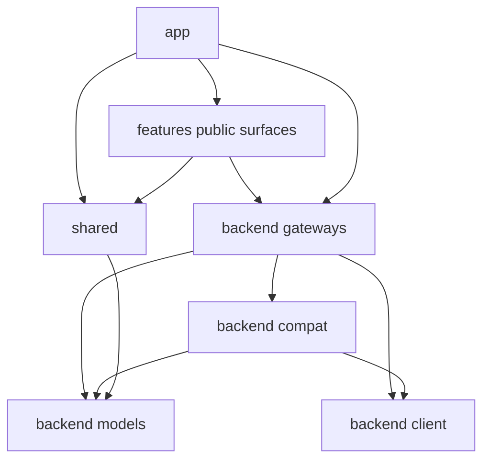

# Feature Design

## Overview

Restrukturisasi ini membangun ulang frontend aktif di `frontend/src` sambil mempertahankan `frontend/src-old` sebagai referensi read-only. Tujuan utamanya bukan redesign, tetapi membentuk boundary yang lebih tegas antara app shell, feature modules, shared UI/utilities, dan backend access. Desain ini mengutamakan migration-by-slice: source baru disiapkan lebih dulu, lalu feature dipindahkan satu per satu dengan adapter kompatibilitas agar parity UI/behavior tetap terjaga.

Keputusan inti:

- `frontend/src-old` tidak ikut menjadi bagian dependency runtime source baru.
- `frontend/src` menjadi satu-satunya source aktif untuk build, type check, dan import alias `@/*`.
- Seluruh akses backend dipusatkan di `frontend/src/backend` dengan empat sub-boundary: `client`, `gateways`, `compat`, `models`.
- `app/` dibatasi hanya untuk shell, bootstrap, overlay, provider, route/tab composition, dan orchestration lintas feature.
- Feature dimigrasikan bertahap melalui public surface yang jelas agar dependency graph tetap sehat.

## Architecture

### Target Folder Layout

```text
frontend/
  src-old/                  # read-only reference, not imported by active source
  src/
    main.ts
    App.svelte
    app/
      bootstrap/
      providers/
      routes/
      shell/
      overlays/
      services/
      lib/
      types/
    backend/
      client/
      gateways/
      compat/
      models/
    features/
      accounts/
      router/
      logs/
      usage/
      settings/
    shared/
      api/
      components/
      lib/
      stores/
    components/
      common/
    styles/
    tabs/                   # hanya sementara selama migrasi komposisi lama
```

### Dependency Direction



Aturan arah dependensi:

- `app` boleh bergantung pada public surface feature, `shared`, dan `backend`.
- `features` boleh bergantung pada `shared`, `backend`, dan internal feature sendiri.
- `features` tidak boleh mengimpor internal feature lain.
- `components/common` hanya boleh bergantung pada `shared` dan style tokens, bukan ke feature spesifik.
- `backend/*` tidak boleh mengimpor `app` atau `features`.
- `src` aktif tidak boleh mengimpor apa pun dari `src-old`.

## Components and Interfaces

### `backend/client`

Peran:

- Menjadi boundary paling dekat ke transport/backend vendor-specific.
- Menyimpan wrapper binding Wails, browser runtime integration, dan fetch client yang benar-benar low-level.

Isi tipikal:

- `wails-client.ts` untuk re-export binding generated Wails.
- `runtime-events.ts` untuk subscription event Wails/browser.
- `http-client.ts` bila ada kebutuhan fetch langsung ke proxy lokal.

Aturan:

- Tidak ada mapping domain di sini selain normalisasi sangat teknis.
- Tidak digunakan langsung oleh UI atau feature.

### `backend/models`

Peran:

- Menyediakan tipe model backend-facing yang stabil untuk layer lain.
- Memisahkan raw Wails/generated models dari model aplikasi yang sudah dinormalisasi.

Isi tipikal:

- alias type Wails/generated yang memang perlu dipakai internal backend layer.
- DTO/domain model normalize result untuk state frontend.

Aturan:

- Type yang dipakai lintas feature harus diekspos dari sini atau dari model feature yang sudah final.

### `backend/compat`

Peran:

- Menangani translasi payload mentah, bentuk historis, snake_case/camelCase, guard, coercion, dan mapper kompatibilitas.

Isi tipikal:

- `record.ts`, `coerce.ts`, `pick.ts`, dan mapper per domain seperti `accounts-compat.ts`, `router-compat.ts`.

Aturan:

- Seluruh logika kompatibilitas yang sebelumnya tersebar di feature dipindahkan ke sini.
- Modul ini boleh dipakai oleh gateway, tetapi UI/feature sebaiknya menerima hasil yang sudah bersih.

### `backend/gateways`

Peran:

- Menjadi API domain-oriented yang dipakai `app/` dan `features/`.
- Menggabungkan `backend/client` dan `backend/compat` menjadi kontrak yang stabil.

Struktur yang disarankan:

```text
backend/gateways/
  system-gateway.ts
  logs-gateway.ts
  accounts-gateway.ts
  auth-gateway.ts
  router-gateway.ts
  index.ts
```

Contoh kontrak:

```ts
export interface AccountsGateway {
  getAccounts(): Promise<Account[]>;
  refreshAccountWithQuota(accountId: string): Promise<void>;
  toggleAccount(accountId: string, enabled: boolean): Promise<void>;
}
```

Aturan:

- Gateway mengembalikan type yang siap dipakai state/frontend.
- Gateway menjadi satu-satunya boundary backend yang diimpor feature dan app.

### `app/`

Peran target:

- Menyusun bootstrap, shell layout, modal global, overlay global, tab/route composition, dan orchestration lintas feature.

Subfolder target:

- `bootstrap/`: startup binding, app lifecycle, event bootstrap.
- `providers/`: provider host untuk overlay/global context.
- `routes/`: metadata dan composition route/tab.
- `shell/`: frame, header, footer, layout shell.
- `overlays/`: host overlay global dan modal stack.
- `services/`: orchestration lintas feature seperti app controller/log subscription.
- `lib/` dan `types/`: helper dan kontrak app-level.

Aturan:

- `app/` tidak menyimpan API backend spesifik domain.
- `app/` tidak menampung state/helper yang sebenarnya milik feature tunggal.

### `features/*`

Per feature target memiliki pola seragam:

```text
features/<feature>/
  components/
  lib/
  stores/
  models/
  services/
  index.ts
```

Catatan:

- `api/` pada feature lama dihapus sebagai pola utama; akses backend dipindah ke `backend/gateways`.
- Jika feature membutuhkan adapter lokal murni presentational/domain, letakkan di `lib/` atau `models/`, bukan `api/`.
- `index.ts` menjadi public surface feature.

### `shared/` dan `components/common/`

- `shared/` menyimpan utilitas lintas feature, store global non-domain, helper UI-agnostic, dan adapter umum.
- `components/common/` menyimpan primitive UI reusable yang netral domain.
- Komponen domain-specific tetap berada di feature masing-masing.

## Import Rules

Aturan import harus eksplisit dan dapat ditegakkan lewat linting/checklist review.

### Allowed

- `app/*` -> `features/<feature>/index`, `shared/*`, `backend/gateways/*`, `backend/models/*`
- `features/<feature>/*` -> `shared/*`, `backend/gateways/*`, `backend/models/*`, internal feature sendiri
- `backend/gateways/*` -> `backend/client/*`, `backend/compat/*`, `backend/models/*`
- `components/common/*` -> `shared/*`, `backend/models/*` bila benar-benar generik

### Forbidden

- `src/*` -> `src-old/*`
- `features/a/*` -> `features/b/components/*` atau internal implementation feature lain
- `app/*` atau `features/*` -> `wailsjs/*`
- `backend/*` -> `app/*` atau `features/*`
- `components/common/*` -> `features/*`

### Naming Rules

- Folder feature: kebab-case (`endpoint-tester`, `model-alias`).
- Komponen Svelte: PascalCase (`ProxyRuntimeCard.svelte`).
- File gateway/mapper/service/helper: kebab-case (`router-gateway.ts`, `logs-subscription.ts`).
- Public surface: `index.ts` pada folder feature atau boundary yang memang perlu diekspor.
- Type/domain model: nama deskriptif; suffix dipakai hanya bila menambah kejelasan (`ProxyStatus`, `CliSyncStatus`, `AccountAuthSession`).

## Migration Strategy

### Phase 0 - Baseline Lock

- Pastikan `frontend/src-old` diposisikan sebagai referensi read-only.
- Pastikan `frontend/src` menjadi source aktif build.
- Dokumentasikan parity goal: no UI/behavior changes.

### Phase 1 - Scaffold Active Source

- Bentuk kerangka folder `frontend/src` baru.
- Tambahkan entrypoints, path alias, dan public surface minimal.
- Pindahkan primitive/shared infra yang tidak domain-specific lebih dulu.

### Phase 2 - Backend Boundary Extraction

- Buat `backend/client`, `backend/compat`, `backend/models`, `backend/gateways`.
- Ambil seluruh wrapper Wails dan coercion adapter dari pola lama.
- Pastikan feature baru hanya menggunakan gateway.

### Phase 3 - App Shell Cleanup

- Bangun ulang `App.svelte`, app controller, shell layout, overlay host, bootstrap runtime.
- Kurangi `app/` agar hanya menyimpan orchestration lintas feature.

### Phase 4 - Feature-by-Feature Migration

Urutan yang disarankan:

1. `logs` - scope kecil, bagus untuk validasi event/gateway.
2. `router` - memvalidasi backend boundary paling luas.
3. `accounts` - memvalidasi auth/session/state yang lebih kompleks.
4. `usage` - memvalidasi model formatting dan workspace ringan.
5. `settings` atau modul residual lain - setelah shared pattern stabil.

Untuk tiap feature:

- pindahkan model/helper internal yang masih relevan,
- bangun public surface,
- hubungkan ke gateway,
- sambungkan ke `app/` composition,
- cek parity UI/behavior,
- hapus dependency ke pola lama.

### Phase 5 - Hardening

- Audit import graph.
- Rapikan naming akhir.
- Hapus folder sementara di `src` yang tidak lagi diperlukan.
- Perbarui README frontend agar sesuai struktur final.

## Data Models

Contoh tipe boundary yang disarankan:

```ts
export interface BackendRecord {
  [key: string]: unknown;
}

export interface CompatMapper<T> {
  fromPayload(payload: unknown): T;
}

export interface GatewayResult<T> {
  data: T;
}
```

Contoh pembagian model:

- `backend/models/wails.ts`: alias ke generated models yang masih dibutuhkan internal.
- `backend/models/system.ts`: `AppState`, `LogEntry`, `UpdateInfo` yang sudah dipakai app.
- `backend/models/accounts.ts`: `Account`, `AuthSession`, sync result.
- `backend/models/router.ts`: `ProxyStatus`, `CliSyncStatus`, `LocalModelCatalogItem`.

Prinsip:

- Model raw/generated tidak bocor langsung ke UI kecuali memang identik dan stabil.
- Mapper kompatibilitas berada di `backend/compat`, bukan di file model.

## Error Handling

- Error low-level dari Wails/fetch ditangani di gateway dan dikonversi menjadi pesan/shape yang konsisten.
- Helper coercion defensif tetap berada di `backend/compat` untuk payload yang tidak terjamin bentuknya.
- `app/` dan `features/` hanya menangani error pada level use-case/UI feedback, misalnya toast atau loading state.
- Setiap migrasi feature harus mempertahankan perilaku error yang sudah terlihat pengguna.

## Testing Strategy

- Gunakan `npm run check` sebagai guard utama pada setiap fase.
- Tambahkan test/unit coverage hanya bila pola proyek mulai mendukungnya; restrukturisasi ini tidak mewajibkan framework test baru.
- Lakukan smoke verification untuk entrypoints utama: bootstrap app, tabs/routes, logs subscription, proxy controls, account actions.
- Tambahkan checklist parity per feature agar perubahan internal tidak mengubah hasil UI.

Checklist parity per feature:

- komponen utama tampil dengan struktur yang sama,
- action utama tetap memanggil operasi backend yang sama,
- state loading/error/success tetap konsisten,
- route/tab composition tetap identik,
- format data dan label yang tampil tidak berubah.
