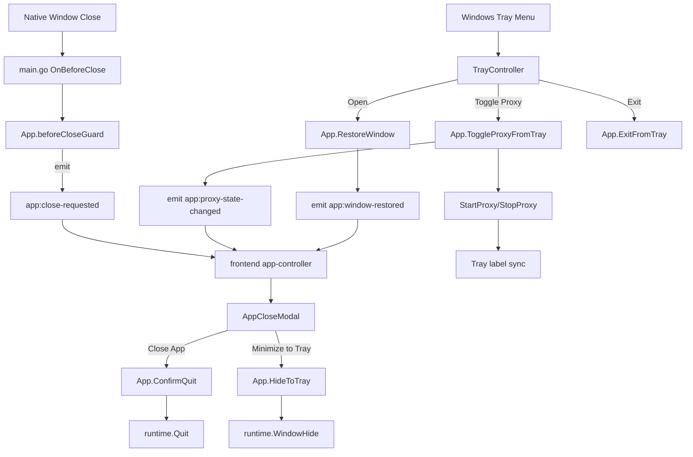

# Feature Design

## Overview

Fitur ini menambahkan lapisan kontrol lifecycle window yang eksplisit di CLIro-Go. Tombol close native tidak lagi langsung menyembunyikan window, tetapi akan dicegat oleh backend Wails lalu diteruskan ke frontend sebagai event untuk menampilkan modal konfirmasi close. Modal tersebut memakai primitive modal yang sudah ada agar visual dan perilakunya konsisten dengan UI aplikasi saat ini.

Untuk Windows, fitur ini juga menambahkan tray icon dan tray menu sebagai entry point background control. Tray harus mampu membuka kembali window utama, menyalakan atau mematikan API Router proxy, dan keluar dari aplikasi tanpa menampilkan modal close ulang. Karena versi Wails yang dipakai repo ini tidak mengekspos tray API publik yang aman untuk dipakai langsung, tray akan diimplementasikan sebagai adapter Windows-only terpisah di backend.

Keputusan desain utama:

1. `HideWindowOnClose` dimatikan agar klik `X` tidak lagi bypass alur konfirmasi.
2. `OnBeforeClose` dipakai sebagai guard sinkron di backend, lalu frontend modal memutuskan aksi final.
3. Tray diimplementasikan sebagai capability opsional Windows-only dengan fallback aman bila inisialisasi gagal.
4. State tray tidak dijadikan source of truth utama; source of truth tetap `App`, `config.Manager`, dan `gateway.Server`.

## Architecture



### Runtime Flow

#### Window close flow

1. User menekan tombol close native.
2. Wails memanggil `OnBeforeClose`.
3. Backend `App.beforeCloseGuard` memeriksa apakah quit ini memang sudah diizinkan.
4. Jika belum diizinkan, backend emit `app:close-requested` lalu mengembalikan `prevent=true`.
5. Frontend menerima event dan membuka modal close.
6. User memilih `Close App` atau `Minimize to Tray`.
7. Backend menjalankan aksi final.

#### Tray flow

1. Backend menginisialisasi tray controller saat startup pada Windows.
2. Tray controller mendaftarkan tray icon dan menu item.
3. Menu item memanggil callback backend pada goroutine terpisah.
4. Backend menyinkronkan label tray berdasarkan state proxy saat ini.
5. Backend emit event ke frontend jika aksi tray mengubah state yang perlu direfresh.

## Components and Interfaces

### 1. `main.go`

#### Perubahan

- Ganti `HideWindowOnClose: true` menjadi `false`.
- Tambahkan `OnBeforeClose: app.beforeCloseGuard` pada `options.App`.

#### Rationale

Di Wails v2.11, `HideWindowOnClose: true` membuat tombol close native langsung memanggil hide dan tidak memberi kesempatan ke alur modal konfirmasi. Karena itu close interception harus dipindahkan ke `OnBeforeClose`.

### 2. `app.go`

`App` tetap menjadi facade utama untuk close flow, tray action, dan sinkronisasi event frontend.

#### Field additions

```go
type App struct {
    // existing fields...

    lifecycleMu    sync.Mutex
    allowQuitOnce  bool
    tray           TrayController
}
```

#### New methods

```go
func (a *App) beforeCloseGuard(ctx context.Context) bool
func (a *App) ConfirmQuit()
func (a *App) HideToTray()
func (a *App) RestoreWindow()
func (a *App) ExitFromTray()
func (a *App) ToggleProxyFromTray() error
func (a *App) emitProxyStateChanged(source string)
func (a *App) emitWindowRestored(source string)
func (a *App) syncTrayState()
```

#### Method behavior

- `beforeCloseGuard`
  - Jika `allowQuitOnce` aktif, reset flag lalu `return false` agar quit diteruskan.
  - Jika tidak, emit `app:close-requested` dan `return true` untuk mencegah close.
- `ConfirmQuit`
  - Set `allowQuitOnce=true`.
  - Panggil `runtime.Quit(a.ctx)`.
- `HideToTray`
  - Panggil `WindowHide`, bukan shutdown.
- `RestoreWindow`
  - Reuse pola restore yang sudah dipakai di `onSecondInstanceLaunch`.
  - Emit `app:window-restored`.
- `ExitFromTray`
  - Sama dengan `ConfirmQuit`, tapi tidak membuka modal.
- `ToggleProxyFromTray`
  - Toggle berdasarkan `a.proxy.Running()`.
  - Reuse `StartProxy` dan `StopProxy` yang sudah ada.
  - Emit `app:proxy-state-changed` setelah sukses.
- `syncTrayState`
  - Update label/enable state menu tray berdasarkan status proxy saat ini.

### 3. Tray controller backend

#### Package shape

Disarankan membuat package baru:

```text
internal/tray/
  controller.go
  controller_windows.go
  controller_other.go
  assets/
    cliro-tray.ico
```

#### Interface

```go
type TrayController interface {
    Start() error
    Update(TrayState)
    Close()
}

type TrayState struct {
    Ready        bool
    ProxyRunning bool
    ProxyBusy    bool
}
```

#### Windows implementation

- Windows-only implementation menggunakan external tray adapter.
- Adapter direkomendasikan memakai `github.com/getlantern/systray` dengan `Register()` agar bisa hidup berdampingan dengan Wails window loop.
- Menu items:
  - `Open`
  - `Enable API Router Proxy` / `Disable API Router Proxy`
  - separator
  - `Exit App`

#### Adapter behavior

- `Open` memanggil `App.RestoreWindow()`.
- Toggle proxy memanggil `App.ToggleProxyFromTray()`.
- `Exit App` memanggil `App.ExitFromTray()`.
- `Update()` mengganti judul item toggle proxy berdasarkan state runtime.

#### Tray asset strategy

- Jangan mengandalkan file icon dari `build/` lewat relative path runtime.
- Simpan icon tray khusus di package-local asset agar bisa di-embed dan tetap tersedia di dev maupun build production.

### 4. Frontend controller

File utama: `frontend/src/app/services/app-controller.ts`.

#### Overlay state additions

```ts
export interface AppOverlayState {
  showUpdatePrompt: boolean
  showConfigurationErrorModal: boolean
  showCloseConfirmModal: boolean
  startupWarnings: StartupWarningEntry[]
  updateInfo: UpdateInfo | null
}
```

#### New app actions

```ts
confirmQuit: () => Promise<void>
hideToTray: () => Promise<void>
dismissClosePrompt: () => void
```

#### Event subscriptions

Tambahkan subscription untuk:

- `app:close-requested`
- `app:window-restored`
- `app:proxy-state-changed`

#### Behavior

- `app:close-requested` -> buka modal close.
- `app:window-restored` -> jalankan `refreshCore()` dan `refreshProxyStatusSafe()`.
- `app:proxy-state-changed` -> jalankan `refreshProxySnapshotSafe()`.

### 5. Frontend modal

Tambahkan file baru:

```text
frontend/src/app/modals/AppCloseModal.svelte
```

#### UI structure

- Reuse `BaseModal` + `ModalWindowHeader`.
- Body menjelaskan dua aksi:
  - `Close App` = shutdown penuh
  - `Minimize to Tray` = hide window, runtime tetap aktif
- Footer actions:
  - `Minimize to Tray`
  - `Close App`
  - optional ghost dismiss button atau close by backdrop

#### UX rules

- Dismiss/backdrop close hanya menutup modal, tidak menutup app.
- Jika tray unavailable pada sesi itu, tombol `Minimize to Tray` tetap tampil tetapi disabled dengan helper text singkat.

### 6. Frontend overlay composition

`frontend/src/app/providers/AppOverlayStack.svelte` akan ditambah satu modal baru setelah overlay global lain.

Urutan modal global:

1. Configuration recovery
2. Update required
3. Close confirm

Tujuannya supaya close modal tetap berada dalam stack global yang sama dan tidak bocor ke feature-specific workspace.

### 7. Wails bindings and API adapters

#### Backend-exposed methods

Metode baru dari `App` yang harus dibind ke frontend:

- `ConfirmQuit()`
- `HideToTray()`
- `RestoreWindow()`

#### Frontend binding updates

- `frontend/src/shared/api/wails/client.ts`
- `frontend/src/app/api/system-api.ts`

Frontend tidak perlu memanggil runtime Wails `Quit()` langsung, karena guard `allowQuitOnce` harus dikelola backend.

## Data Models

### Backend state additions

#### `State` payload

Tambahan ke `main.State` di `app.go`:

```go
type State struct {
    // existing fields...
    TraySupported bool `json:"traySupported,omitempty"`
    TrayAvailable bool `json:"trayAvailable,omitempty"`
}
```

#### Purpose

- `TraySupported`: platform/feature support statis.
- `TrayAvailable`: status runtime hasil inisialisasi tray.

Frontend memakai field ini untuk menentukan apakah tombol `Minimize to Tray` aktif.

### Event payloads

#### `app:close-requested`

Tidak memerlukan payload kompleks. Cukup event kosong atau payload minimal.

#### `app:window-restored`

Payload ringan:

```json
{
  "source": "tray"
}
```

#### `app:proxy-state-changed`

Payload ringan:

```json
{
  "source": "tray",
  "running": true
}
```

## Error Handling

### Close interception errors

- Jika `a.ctx` belum siap saat close guard dipanggil, backend fallback ke `return false` agar aplikasi tetap bisa keluar bersih.
- Jika `ConfirmQuit()` dipanggil tanpa context valid, log error dan jangan deadlock lifecycle state.

### Tray initialization errors

- Gagal init tray tidak boleh menghentikan startup app.
- Error dicatat ke `system log`.
- `TrayAvailable=false` diset di state agar frontend men-disable aksi tray-dependent.

### Tray proxy toggle errors

- Jika start/stop proxy gagal, tray menu di-refresh kembali ke state sebelumnya.
- Backend emit error log, tetapi tidak emit `app:proxy-state-changed` sukses.

### Restore window errors

- Jika restore dipanggil saat context belum siap, backend log warning dan no-op.

## Testing Strategy

### Go tests

- Tambah unit test untuk close guard lifecycle:
  - close pertama dicegat
  - `ConfirmQuit()` mengizinkan quit berikutnya
  - `ExitFromTray()` bypass modal
- Tambah test untuk tray state builder / label toggle proxy.
- Tambah test untuk event-emission helper bila dibuat sebagai fungsi terpisah.

### Frontend validation

- `npm run check` untuk memastikan typing dan binding baru valid.
- Karena repo belum punya frontend unit-test harness, state transition logic close modal sebaiknya ditempatkan di controller helper yang kecil dan deterministic agar mudah diverifikasi.

### Manual verification

Windows manual checklist:

1. Klik tombol `X` -> modal close muncul.
2. Pilih `Minimize to Tray` -> window hide, tray icon tetap ada.
3. Klik tray `Open` -> window kembali ke depan.
4. Klik tray `Enable/Disable API Router Proxy` -> state proxy berubah dan UI refresh saat dibuka kembali.
5. Klik tray `Exit App` -> app shutdown penuh tanpa modal kedua.
6. Klik `Close App` dari modal -> app shutdown penuh dan cleanup backend berjalan.

## Risks and Trade-offs

### 1. External tray dependency

Menggunakan external tray adapter menambah dependency dan terutama untuk `systray` akan membawa kebutuhan `cgo`. Karena itu implementasi dibatasi Windows-first dan dibungkus di package terisolasi agar impact-nya terkendali.

### 2. Native close behavior changes

Begitu `HideWindowOnClose` dimatikan, semua close dari title bar akan masuk ke alur modal. Ini memang yang diinginkan, tetapi artinya modal flow harus stabil dan cepat.

### 3. Event duplication

Frontend sudah punya refresh flow sendiri sesudah aksi UI. Event tray menambah jalur refresh kedua. Desain ini menerima sedikit duplikasi refresh demi menjaga sinkronisasi state tetap sederhana.

### 4. Tray unavailable fallback

Jika tray gagal init, user tetap bisa memakai app dan menutup app sepenuhnya. Trade-off-nya, opsi `Minimize to Tray` tidak dapat dipakai pada sesi tersebut.

## Implementation Notes

- Reuse helper restore window dari `onSecondInstanceLaunch` supaya perilaku fokus window konsisten.
- Sinkronisasi label tray sebaiknya dipanggil tidak hanya dari tray action, tapi juga setelah `StartProxy()` dan `StopProxy()` biasa agar tray tidak stale bila proxy diubah dari UI utama.
- Modal close sebaiknya ditempatkan di `app/modals` karena ini lifecycle concern global, bukan feature-specific concern.
